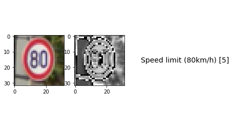

Self-Driving Car Engineer Nanodegree
====================================

Deep Learning
-------------

Project: Build a Traffic Sign Recognition Classifier
----------------------------------------------------

In this notebook, a template is provided for you to implement your
functionality in stages, which is required to successfully complete this
project. If additional code is required that cannot be included in the
notebook, be sure that the Python code is successfully imported and
included in your submission if necessary.

    **Note**: Once you have completed all of the code implementations,
    you need to finalize your work by exporting the iPython Notebook as
    an HTML document. Before exporting the notebook to html, all of the
    code cells need to have been run so that reviewers can see the final
    implementation and output. You can then export the notebook by using
    the menu above and navigating to :raw-latex:`\n`", "**File ->
    Download as -> HTML (.html)**. Include the finished document along
    with this notebook as your submission.

In addition to implementing code, there is a writeup to complete. The
writeup should be completed in a separate file, which can be either a
markdown file or a pdf document. There is a `write up
template <https://github.com/udacity/CarND-Traffic-Sign-Classifier-Project/blob/master/writeup_template.md>`__
that can be used to guide the writing process. Completing the code
template and writeup template will cover all of the `rubric
points <https://review.udacity.com/#!/rubrics/481/view>`__ for this
project.

The `rubric <https://review.udacity.com/#!/rubrics/481/view>`__ contains
"Stand Out Suggestions" for enhancing the project beyond the minimum
requirements. The stand out suggestions are optional. If you decide to
pursue the "stand out suggestions", you can include the code in this
Ipython notebook and also discuss the results in the writeup file.

    **Note:** Code and Markdown cells can be executed using the **Shift
    + Enter** keyboard shortcut. In addition, Markdown cells can be
    edited by typically double-clicking the cell to enter edit mode.

--------------

Step 0: Load The Data
---------------------

.. code:: ipython3

    # Load pickled data
    import pickle
    
    # TODO: Fill this in based on where you saved the training and testing data
    
    training_file = './data/train.p'
    validation_file= './data/valid.p'
    testing_file = './data/test.p'
    
    with open(training_file, mode='rb') as f:
        train = pickle.load(f)
    with open(validation_file, mode='rb') as f:
        valid = pickle.load(f)
    with open(testing_file, mode='rb') as f:
        test = pickle.load(f)
        
    X_train, y_train = train['features'], train['labels']
    X_valid, y_valid = valid['features'], valid['labels']
    X_test, y_test = test['features'], test['labels']

--------------

Step 1: Dataset Summary & Exploration
-------------------------------------

The pickled data is a dictionary with 4 key/value pairs:

-  ``'features'`` is a 4D array containing raw pixel data of the traffic
   sign images, (num examples, width, height, channels).
-  ``'labels'`` is a 1D array containing the label/class id of the
   traffic sign. The file ``signnames.csv`` contains id -> name mappings
   for each id.
-  ``'sizes'`` is a list containing tuples, (width, height) representing
   the original width and height the image.
-  ``'coords'`` is a list containing tuples, (x1, y1, x2, y2)
   representing coordinates of a bounding box around the sign in the
   image. **THESE COORDINATES ASSUME THE ORIGINAL IMAGE. THE PICKLED
   DATA CONTAINS RESIZED VERSIONS (32 by 32) OF THESE IMAGES**

Complete the basic data summary below. Use python, numpy and/or pandas
methods to calculate the data summary rather than hard coding the
results. For example, the `pandas shape
method <http://pandas.pydata.org/pandas-docs/stable/generated/pandas.DataFrame.shape.html>`__
might be useful for calculating some of the summary results.

Provide a Basic Summary of the Data Set Using Python, Numpy and/or Pandas
~~~~~~~~~~~~~~~~~~~~~~~~~~~~~~~~~~~~~~~~~~~~~~~~~~~~~~~~~~~~~~~~~~~~~~~~~

.. code:: ipython3

    ### Replace each question mark with the appropriate value. 
    ### Use python, pandas or numpy methods rather than hard coding the results
    
    # TODO: Number of training examples
    n_train = X_train.shape[0]
    
    # TODO: Number of validation examples
    n_validation = X_valid.shape[0]
    
    # TODO: Number of testing examples.
    n_test = X_test.shape[0]
    
    # TODO: What's the shape of an traffic sign image?
    image_shape = X_train[0].shape
    
    # TODO: How many unique classes/labels there are in the dataset.
    n_classes = len(set(y_train))
    
    print("Number of training examples =", n_train)
    print("Number of testing examples =", n_test)
    print("Image data shape =", image_shape)
    print("Number of classes =", n_classes)


.. parsed-literal::

    Number of training examples = 34799
    Number of testing examples = 12630
    Image data shape = (32, 32, 3)
    Number of classes = 43


Include an exploratory visualization of the dataset
~~~~~~~~~~~~~~~~~~~~~~~~~~~~~~~~~~~~~~~~~~~~~~~~~~~

Visualize the German Traffic Signs Dataset using the pickled file(s).
This is open ended, suggestions include: plotting traffic sign images,
plotting the count of each sign, etc.

The `Matplotlib <http://matplotlib.org/>`__
`examples <http://matplotlib.org/examples/index.html>`__ and
`gallery <http://matplotlib.org/gallery.html>`__ pages are a great
resource for doing visualizations in Python.

**NOTE:** It's recommended you start with something simple first. If you
wish to do more, come back to it after you've completed the rest of the
sections. It can be interesting to look at the distribution of classes
in the training, validation and test set. Is the distribution the same?
Are there more examples of some classes than others?

.. code:: ipython3

    import numpy as np
    
    print("Training data: %s" % X_train.shape[0])
    print("Validation data: %s" % X_valid.shape[0])
    print("Test data: %s" % X_test.shape[0])
    
    idx = np.random.randint(0, len(X_train))
    idx_valid = np.random.randint(0, len(X_valid))
    idx_test = np.random.randint(0, len(X_test))
    
    assert X_train.shape[0] == y_train.shape[0]
    assert X_valid.shape[0] == y_valid.shape[0]
    assert X_test.shape[0] == y_test.shape[0]
    assert X_train[idx].shape == X_valid[idx_valid].shape == X_test[idx_test].shape


.. parsed-literal::

    Training data: 34799
    Validation data: 4410
    Test data: 12630


.. code:: ipython3

    ### Data exploration visualization code goes here.
    ### Feel free to use as many code cells as needed.
    import matplotlib.pyplot as plt
    import matplotlib.gridspec as gridspec
    # Visualizations will be shown in the notebook.
    %matplotlib inline
    
    import csv
    with open("signnames.csv", "r") as f:
        reader = csv.reader(f, delimiter=",")
        reader.__next__()
        classes = dict(reader)
        
    idx = np.random.randint(0, len(X_train))
    
    f = plt.figure()
    
    gs = gridspec.GridSpec(1, 2, width_ratios=[1, 2], height_ratios=[1])
    
    plt.subplot(gs[0])
    plt.imshow(X_train[idx])
    plt.xlabel(classes[str(y_train[idx])])
    plt.ylabel(y_train[idx])
    
    train_hist = np.histogram(y_train, bins=sorted(set(y_train)))
    train_dict = dict(zip(train_hist[1], train_hist[0]))
    
    import pprint
    pp = pprint.PrettyPrinter(indent=4)
    pp.pprint(train_dict)
    
    plt.subplot(gs[1])
    _ = plt.hist(y_train, bins=sorted(set(y_train)))
    _ = plt.hist(y_test, bins=sorted(set(y_test)))
    _ = plt.hist(y_valid, bins=sorted(set(y_valid)))


.. parsed-literal::

    {   0: 180,
        1: 1980,
        2: 2010,
        3: 1260,
        4: 1770,
        5: 1650,
        6: 360,
        7: 1290,
        8: 1260,
        9: 1320,
        10: 1800,
        11: 1170,
        12: 1890,
        13: 1920,
        14: 690,
        15: 540,
        16: 360,
        17: 990,
        18: 1080,
        19: 180,
        20: 300,
        21: 270,
        22: 330,
        23: 450,
        24: 240,
        25: 1350,
        26: 540,
        27: 210,
        28: 480,
        29: 240,
        30: 390,
        31: 690,
        32: 210,
        33: 599,
        34: 360,
        35: 1080,
        36: 330,
        37: 180,
        38: 1860,
        39: 270,
        40: 300,
        41: 420}


--------------

Step 2: Design and Test a Model Architecture
--------------------------------------------

Design and implement a deep learning model that learns to recognize
traffic signs. Train and test your model on the `German Traffic Sign
Dataset <http://benchmark.ini.rub.de/?section=gtsrb&subsection=dataset>`__.

The LeNet-5 implementation shown in the
`classroom <https://classroom.udacity.com/nanodegrees/nd013/parts/fbf77062-5703-404e-b60c-95b78b2f3f9e/modules/6df7ae49-c61c-4bb2-a23e-6527e69209ec/lessons/601ae704-1035-4287-8b11-e2c2716217ad/concepts/d4aca031-508f-4e0b-b493-e7b706120f81>`__
at the end of the CNN lesson is a solid starting point. You'll have to
change the number of classes and possibly the preprocessing, but aside
from that it's plug and play!

With the LeNet-5 solution from the lecture, you should expect a
validation set accuracy of about 0.89. To meet specifications, the
validation set accuracy will need to be at least 0.93. It is possible to
get an even higher accuracy, but 0.93 is the minimum for a successful
project submission.

There are various aspects to consider when thinking about this problem:

-  Neural network architecture (is the network over or underfitting?)
-  Play around preprocessing techniques (normalization, rgb to
   grayscale, etc)
-  Number of examples per label (some have more than others).
-  Generate fake data.

Here is an example of a `published baseline model on this
problem <http://yann.lecun.com/exdb/publis/pdf/sermanet-ijcnn-11.pdf>`__.
It's not required to be familiar with the approach used in the paper
but, it's good practice to try to read papers like these.

Pre-process the Data Set (normalization, grayscale, etc.)
~~~~~~~~~~~~~~~~~~~~~~~~~~~~~~~~~~~~~~~~~~~~~~~~~~~~~~~~~

Minimally, the image data should be normalized so that the data has mean
zero and equal variance. For image data, ``(pixel - 128)/ 128`` is a
quick way to approximately normalize the data and can be used in this
project.

Other pre-processing steps are optional. You can try different
techniques to see if it improves performance.

Use the code cell (or multiple code cells, if necessary) to implement
the first step of your project.

.. code:: ipython3

    from scipy.ndimage import gaussian_filter, rotate, shift, zoom
    from sklearn.utils import shuffle
    from functools import partial
    
    
    def save_data(features, labels, tofile=None):
        np.savez_compressed(tofile, features, labels)
    
        
    def load_data(fromfile=None):
        loaded = np.load('%s.npz' % fromfile)
        return loaded['arr_0'], loaded['arr_1']
        
        
    def get_transforms():
        gaussian_param = np.random.uniform(0, 1)
        rotate_param = np.random.uniform(-2, 2)
        shift_param_x = np.random.uniform(-2, 2)
        shift_param_y = np.random.uniform(-2, 2)
        shift_param_z = np.random.uniform(-0.9, 0.9)
        shift_param = [0, shift_param_x, shift_param_y, shift_param_z]
        zoom_param = np.random.uniform(1, 1)
        apply_rotate = partial(rotate, angle=rotate_param, reshape=False, mode='nearest')
        apply_gauss = partial(gaussian_filter, sigma=gaussian_param)
        apply_shift = partial(shift, shift=shift_param, mode='nearest')
        apply_zoom = partial(zoom, zoom=zoom_param, mode='nearest')
        return apply_rotate, apply_gauss, apply_shift, apply_zoom
    
    
    def augment_batch(orig_batch, label, debug=False): 
        apply_rotate, apply_gauss, apply_shift, apply_zoom = get_transforms()
        batch = apply_rotate(orig_batch)
        batch = apply_shift(batch)
        # batch = apply_zoom(batch)
        return apply_gauss(batch)
    
    
    def augment(X_train_aug, y_train_aug, threshold=500, desired_count=3000):
        labels = [l for l,c in train_dict.items() if c < threshold]
        print(labels)
        for label in labels:
            a = np.where(y_train==label)
            subset = X_train.take(a, axis=0)[0]
            batch_size = min(len(subset), 300)
            orig_count = len(a[0])
            count = len(np.where(y_train_aug==label)[0])
            while count < desired_count:
                batch = np.random.choice(len(subset), batch_size)
                augmented_data = augment_batch(subset[batch], label, False)
                X_train_aug = np.concatenate((X_train_aug, augmented_data), axis=0)
                y_train_aug = np.concatenate((y_train_aug, augmented_data.shape[0] * [label]), axis=0)
                count = len(np.where(y_train_aug==label)[0])
            msg = "\rLabel %s: %s -> %s\r" % (label, orig_count, count)
            print(msg)
        return X_train_aug, y_train_aug
    
    
    
    def resize(img):
        return imresize(img, (32, 32, 3))
    
    
    def apply_gray(dataset):
        dataset_gray = np.empty([0, 32, 32, 1])
        gray_filter = np.array([[[0.2126]], [[0.7152]], [[0.0722]]])
        batch_size = 3000
        for offset in range(0, len(dataset), batch_size):
            batch = dataset[offset:offset+batch_size]
            batch[:, :, :, 0] = batch[:, :, :, 0] * 0.2126
            batch[:, :, :, 1] = batch[:, :, :, 1] * 0.7152
            batch[:, :, :, 2] = batch[:, :, :, 2] * 0.0722
            
            dataset_gray = np.concatenate(
                (dataset_gray, np.sum(batch, axis=-1, keepdims=True)),
                axis=0
            )
        return dataset_gray
    
    
    def normalize(dataset):
        dataset_out = np.empty([0, 32, 32, 1])
        batch_size = 3000
        for offset in range(0, len(dataset), batch_size):
            batch = dataset[offset:offset+batch_size]
            dataset_out = np.concatenate(
                (dataset_out, (batch - 128)/128),
                axis=0
            )
        return dataset_out
    
    
    def preprocess(imgages):
        return normalize(apply_gray(imgages))

.. code:: ipython3

    # Augment training set
    
    REGENERATE = False
    
    if REGENERATE:
        print("Generating augmented train set.")
        X_train_aug = np.copy(X_train)
        y_train_aug = np.copy(y_train)
        X_train_aug, y_train_aug = augment(X_train_aug, y_train_aug, 3000)
        save_data(X_train_aug, y_train_aug, './data/train_aug.save')
    else:
        try:
            # try to load saved data
            print("Loading augmented train set.")
            X_train_aug, y_train_aug = load_data('./data/train_aug.save')
        except:
            raise Exception("Unable to load data. Set REGENERATE=True and run again.")


.. parsed-literal::

    Loading augmented train set.


.. code:: ipython3

    plt.subplot(gs[1])
    _ = plt.hist(y_train_aug, bins=sorted(set(y_train_aug)))


.. code:: ipython3

    ### Preprocess the data here. It is required to normalize the data. Other preprocessing steps could include 
    ### converting to grayscale, etc.
    ### Feel free to use as many code cells as needed.
    
    # X_train_norm = np.mean(X_train_norm, axis=-1, keepdims=True)
    # X_valid_norm = np.mean(X_valid_norm, axis=-1, keepdims=True)
    
    X_train_gray = np.empty([0, 32, 32, 1])
    X_valid_gray = np.empty([0, 32, 32, 1])
    
    
    REGENERATE = False 
    if REGENERATE:
        print("Regenerating grayscale train data.")
    
        X_train_gray = apply_gray(X_train_aug)
        save_data(X_train_gray, None, './data/train_gray.save')
    else:
        try:
            print("Loading grayscale train data.")
            X_train_gray, y_train_gray = load_data('./data/train_gray.save')
        except:
            raise Exception("Unable to load data. Set REGENERATE=True and run again.")
    
    
    REGENERATE = False
    if REGENERATE:
        print("Regenerating grayscale valid data.")
        X_valid_gray = apply_gray(X_valid)
        save_data(X_valid_gray, None, './data/valid_gray.save')
    else:
        try:
            print("Loading grayscale valid data.")
            X_valid_gray, y_valid_gray = load_data('./data/valid_gray.save')
        except:
            raise Exception("Unable to load data. Set REGENERATE=True and run again.")


.. parsed-literal::

    Loading grayscale train data.
    Loading grayscale valid data.


.. code:: ipython3

    REGENERATE = False
    
    X_train_norm = np.empty([0, 32, 32, 1])
    X_valid_norm = np.empty([0, 32, 32, 1])
    
    if REGENERATE:
        print("Regenerating normalized data.")
        X_train_norm = normalize(X_train_gray)
        X_valid_norm = normalize(X_valid_gray)
        save_data(X_train_norm, None, './data/train_norm.p.save')
        save_data(X_valid_norm, None, './data/valid_norm.p.save')
    else:
        try:
            print("Loading normalized train data.")
            X_train_norm, _ = load_data('./data/train_norm.p.save')
            X_valid_norm, _ = load_data('./data/valid_norm.p.save')
        except:
            raise Exception("Unable to load data. Set REGENERATE=True and run again.")


.. parsed-literal::

    Loading normalized train data.


.. code:: ipython3

    f = plt.figure()
    
    idx = np.random.randint(0, len(X_train_norm))
    print("Index: %s" % idx)
    print(X_train_norm[idx].shape)
    
    plt.subplot(131)
    plt.imshow(X_train_aug[idx])
    plt.xlabel(classes[str(y_train_aug[idx])])
    plt.ylabel(y_train_aug[idx])
    
    data = np.dstack(3*[X_train_gray[idx]])
    plt.subplot(132)
    plt.imshow(data)
    plt.xlabel(classes[str(y_train_aug[idx])])
    plt.ylabel(y_train_aug[idx])
    
    plt.subplot(133)
    plt.imshow(np.dstack(3*[X_train_norm[idx]]), cmap='gray')
    plt.xlabel(classes[str(y_train_aug[idx])])
    plt.ylabel(y_train_aug[idx])


.. parsed-literal::

    Index: 30489
    (32, 32, 1)


.. parsed-literal::

    <matplotlib.text.Text at 0x7fe10a758eb8>


Model Architecture
~~~~~~~~~~~~~~~~~~

.. code:: ipython3

    ### Define your architecture here.a
    ### Feel free to use as many code cells as needed.
    import tensorflow as tf
    
    # Arguments used for tf.truncated_normal, randomly defines variables for the weights and biases for each layer
    mu = 0
    sigma = 0.1
    
    x = tf.placeholder(tf.float32, (None, 32, 32, 1))
    y = tf.placeholder(tf.int32, (None))
    keep_prob = tf.placeholder(tf.float32)
    
    # TODO: Layer 1: Convolutional. Input = 32x32x1. Output = 28x28x6.
    l1_weights = tf.Variable(tf.truncated_normal([5, 5, 1, 6], mean=mu, stddev=sigma), name="l1w")
    l1_bias = tf.Variable(tf.truncated_normal([6], mean=mu, stddev=sigma), name="l1b")
    l1_strides = (1, 1, 1, 1)
    l1_padding = 'VALID'
    l1 = tf.nn.conv2d(x, l1_weights, l1_strides, l1_padding) + l1_bias
    
    # TODO: Activation.
    l1_activation = tf.nn.relu(l1, name="l1a")
    
    # TODO: Pooling. Input = 28x28x6. Output = 14x14x6.
    p1 = tf.nn.avg_pool(l1_activation, ksize=[1, 2, 2, 1], strides=[1, 2, 2, 1], padding='VALID', name="l1p")
    
    # TODO: Layer 2: Convolutional. Output = 10x10x16.
    l2_weights = tf.Variable(tf.truncated_normal([5, 5, 6, 16], mean=mu, stddev=sigma), name="l2w")
    l2_bias = tf.Variable(tf.truncated_normal([16], mean=mu, stddev=sigma), name="l2b")
    l2_strides = (1, 1, 1, 1)
    l2_padding = 'VALID'
    l2 = tf.nn.conv2d(p1, l2_weights, l2_strides, l2_padding) + l2_bias
    
    # TODO: Activation.
    l2_activation = tf.nn.relu(l2, name="l2a")
    
    # TODO: Pooling. Input = 10x10x16. Output = 5x5x16.
    p2 = tf.nn.avg_pool(l2_activation, ksize=[1, 2, 2,1], strides=[1, 2, 2, 1], padding='VALID', name="l2p")
    
    p11 = tf.nn.avg_pool(p1, ksize=[1, 2, 2, 1], strides=[1, 2, 2, 1], padding='VALID', name="l1p1")
    p12 = tf.nn.avg_pool(p11, ksize=[1, 2, 2, 1], strides=[1, 1, 1, 1], padding='VALID', name="l1p2")
    p12_flat = tf.reshape(p12, [-1, 6*6*6], name="l1p2flat")
    
    # TODO: Flatten. Input = 5x5x16. Output = 400.
    p2_flat = tf.reshape(p2, [-1, 400], name="l2pflat")
    
    p1p2 = tf.concat(1, values=[p12_flat, p2_flat], name="l1pl2p")
    
    # TODO: Layer 3: Fully Connected. Input = 400. Output = 120.
    fc1_weights = tf.Variable(tf.truncated_normal([616, 400], mean=mu, stddev=sigma), name="fc1w")
    fc1_biases = tf.Variable(tf.truncated_normal([400], mean=mu, stddev=sigma), name="fc1b")
    fc1 = tf.add(tf.matmul(p1p2, fc1_weights), fc1_biases, name="fc1")
    
    # TODO: Activation.
    fc1_activation = tf.nn.relu(fc1, name="fc1a")
    fc1_dropout = tf.nn.dropout(fc1_activation, keep_prob, name="fc1drop")
    
    # TODO: Layer 4: Fully Connected. Input = 120. Output = 84.
    fc2_weights = tf.Variable(tf.truncated_normal([400, 120], mean=mu, stddev=sigma), name="fc2w")
    fc2_biases = tf.Variable(tf.truncated_normal([120], mean=mu, stddev=sigma), name="fc2b")
    fc2 = tf.add(tf.matmul(fc1_dropout, fc2_weights), fc2_biases, name="fc2")
    
    # TODO: Activation.
    fc2_activation = tf.nn.relu(fc2, name="fc2a")
    fc2_dropout = tf.nn.dropout(fc2_activation, keep_prob, name="fc2drop")
    # fc2_dropout = tf.nn.l2_normalize(fc2_activation, dim=-1)
    
    
    # TODO: Layer 4: Fully Connected. Input = 120. Output = 84.
    fc3_weights = tf.Variable(tf.truncated_normal([120, n_classes], mean=mu, stddev=sigma), name="fc3w")
    fc3_biases = tf.Variable(tf.truncated_normal([n_classes], mean=mu, stddev=sigma), name="fc3b")
    logits = tf.add(tf.matmul(fc2_dropout, fc3_weights), fc3_biases, name="logits")

Train, Validate and Test the Model
~~~~~~~~~~~~~~~~~~~~~~~~~~~~~~~~~~

A validation set can be used to assess how well the model is performing.
A low accuracy on the training and validation sets imply underfitting. A
high accuracy on the training set but low accuracy on the validation set
implies overfitting.

.. code:: ipython3

    ### Train your model here.
    ### Calculate and report the accuracy on the training and validation set.
    ### Once a final model architecture is selected, 
    ### the accuracy on the test set should be calculated and reported as well.
    ### Feel free to use as many code cells as needed.
    
    import tensorflow as tf
    
    one_hot_y = tf.one_hot(y, n_classes)
    
    rate = 0.001
    
    cross_entropy = tf.nn.softmax_cross_entropy_with_logits(labels=one_hot_y, logits=logits)
    loss_operation = tf.reduce_mean(cross_entropy)
    optimizer = tf.train.AdamOptimizer(learning_rate = rate)
    training_operation = optimizer.minimize(loss_operation)
    
    correct_prediction = tf.equal(tf.argmax(logits, 1), tf.argmax(one_hot_y, 1))
    accuracy_operation = tf.reduce_mean(tf.cast(correct_prediction, tf.float32))
    saver = tf.train.Saver()
    
    def evaluate(X_data, y_data):
        num_examples = len(X_data)
        total_accuracy = 0
        sess = tf.get_default_session()
        for offset in range(0, num_examples, BATCH_SIZE):
            batch_x, batch_y = X_data[offset:offset+BATCH_SIZE], y_data[offset:offset+BATCH_SIZE]
            accuracy = sess.run(accuracy_operation, feed_dict={x: batch_x, y: batch_y, keep_prob: 1})
            total_accuracy += (accuracy * len(batch_x))
        return total_accuracy / num_examples

.. code:: ipython3

    from sklearn.utils import shuffle
    
    EPOCHS = 10
    BATCH_SIZE = 512
    KEEP_PROB = 0.5
    
    with tf.Session() as sess:
        sess.run(tf.global_variables_initializer())
        saver.restore(sess, './lenet.ckpt')
    
        num_examples = len(X_train)
        
        print("Training...")
        print()
        for i in range(EPOCHS):
            X_train_shuff, y_train_shuff = shuffle(X_train_norm, y_train_aug)
            for offset in range(0, num_examples, BATCH_SIZE):
                end = offset + BATCH_SIZE
                batch_x, batch_y = X_train_shuff[offset:end], y_train_shuff[offset:end]
                sess.run(training_operation, feed_dict={x: batch_x, y: batch_y, keep_prob: KEEP_PROB})
            
            print("EPOCH {} ...".format(i+1))
            training_accuracy = evaluate(X_train_norm, y_train_aug)
            print("Training Accuracy = {:.3f}".format(training_accuracy))
            validation_accuracy = evaluate(X_valid_norm, y_valid)
            print("Validation Accuracy = {:.3f}".format(validation_accuracy))
            print()
            
        saver.save(sess, './lenet.ckpt')
        print("Model saved")


.. parsed-literal::

    Training...
    
    EPOCH 1 ...
    Training Accuracy = 0.992
    Validation Accuracy = 0.969
    
    EPOCH 2 ...
    Training Accuracy = 0.992
    Validation Accuracy = 0.971
    
    EPOCH 3 ...
    Training Accuracy = 0.993
    Validation Accuracy = 0.970
    
    EPOCH 4 ...
    Training Accuracy = 0.993
    Validation Accuracy = 0.970
    
    EPOCH 5 ...
    Training Accuracy = 0.993
    Validation Accuracy = 0.971
    
    EPOCH 6 ...
    Training Accuracy = 0.994
    Validation Accuracy = 0.969
    
    EPOCH 7 ...
    Training Accuracy = 0.994
    Validation Accuracy = 0.972
    
    EPOCH 8 ...
    Training Accuracy = 0.994
    Validation Accuracy = 0.971
    
    EPOCH 9 ...
    Training Accuracy = 0.994
    Validation Accuracy = 0.970
    
    EPOCH 10 ...
    Training Accuracy = 0.994
    Validation Accuracy = 0.970
    
    Model saved


--------------

Step 3: Test a Model on New Images
----------------------------------

To give yourself more insight into how your model is working, download
at least five pictures of German traffic signs from the web and use your
model to predict the traffic sign type.

You may find ``signnames.csv`` useful as it contains mappings from the
class id (integer) to the actual sign name.

Load and Output the Images
~~~~~~~~~~~~~~~~~~~~~~~~~~

.. code:: ipython3

    ### Load the images and plot them here.
    ### Feel free to use as many code cells as needed.
    
    import matplotlib.image as mpimg
    from scipy.misc import imresize
    
    img = mpimg.imread('./upload/1.png')
    print(type(img))
        
    res = preprocess(np.array([resize(img)]))
    
    plt.subplot(131)
    plt.imshow(img)
    plt.subplot(132)
    plt.imshow(resize(img))
    plt.subplot(133)
    plt.imshow(np.dstack(3*[res[0]]), cmap='gray')


.. parsed-literal::

    <class 'numpy.ndarray'>


.. parsed-literal::

    <matplotlib.image.AxesImage at 0x7fe0557d5898>


Predict the Sign Type for Each Image
~~~~~~~~~~~~~~~~~~~~~~~~~~~~~~~~~~~~

.. code:: ipython3

    ### Run the predictions here and use the model to output the prediction for each image.
    ### Make sure to pre-process the images with the same pre-processing pipeline used earlier.
    ### Feel free to use as many code cells as needed.
    import os
    
    def load_images():
        images = []
        for item in os.listdir('upload'):
            try:
                img = resize(mpimg.imread('./upload/%s' % item))
            except:
                print("Unable to load %s" % item)
            else:
                images.append(img)
        return images
    
    images = load_images()
    proc_images = preprocess(np.array(images))
            
    with tf.Session() as sess:
        sess.run(tf.global_variables_initializer())
        saver.restore(sess, './lenet.ckpt')
        predictions = sess.run(tf.argmax(logits, 1), feed_dict={x: proc_images, keep_prob: 1})
    
        for idx, p in enumerate(predictions):
            fig = plt.figure()
            plt.subplot(131)
            plt.imshow(images[idx])
            plt.subplot(132)
            plt.imshow(np.dstack(3*[proc_images[idx]]))
            plt.subplot(133, frameon=False, xticks=(), yticks=())
            plt.text(1, 0.5, "%s [%s]" % (classes[str(p)], p), ha='center', va='center', size=14)
            fig.show()


.. parsed-literal::

    Unable to load .ipynb_checkpoints


.. parsed-literal::

    /root/miniconda3/envs/carnd-term1/lib/python3.5/site-packages/matplotlib/figure.py:402: UserWarning: matplotlib is currently using a non-GUI backend, so cannot show the figure
      "matplotlib is currently using a non-GUI backend, "





.. image:: output_29_10.png


Analyze Performance
-------------------

.. code:: ipython3

    ### Calculate the accuracy for these 5 new images. 
    ### For example, if the model predicted 1 out of 5 signs correctly, it's 20% accurate on these new images.
    
    uploaded_labels = np.array(['5', '12', '2', '28', '38', '17', '36', '25', '17'])
    
    with tf.Session() as sess:
        sess.run(tf.global_variables_initializer())
        saver.restore(sess, './lenet.ckpt')
        upload_accuracy = evaluate(proc_images, uploaded_labels)
        print("Accuracy: %s" % upload_accuracy)


.. parsed-literal::

    Accuracy: 1.0


Output Top 5 Softmax Probabilities For Each Image Found on the Web
~~~~~~~~~~~~~~~~~~~~~~~~~~~~~~~~~~~~~~~~~~~~~~~~~~~~~~~~~~~~~~~~~~

For each of the new images, print out the model's softmax probabilities
to show the **certainty** of the model's predictions (limit the output
to the top 5 probabilities for each image).
```tf.nn.top_k`` <https://www.tensorflow.org/versions/r0.12/api_docs/python/nn.html#top_k>`__
could prove helpful here.

The example below demonstrates how tf.nn.top\_k can be used to find the
top k predictions for each image.

``tf.nn.top_k`` will return the values and indices (class ids) of the
top k predictions. So if k=3, for each sign, it'll return the 3 largest
probabilities (out of a possible 43) and the correspoding class ids.

Take this numpy array as an example. The values in the array represent
predictions. The array contains softmax probabilities for five candidate
images with six possible classes. ``tf.nn.top_k`` is used to choose the
three classes with the highest probability:

::

    # (5, 6) array
    a = np.array([[ 0.24879643,  0.07032244,  0.12641572,  0.34763842,  0.07893497,
             0.12789202],
           [ 0.28086119,  0.27569815,  0.08594638,  0.0178669 ,  0.18063401,
             0.15899337],
           [ 0.26076848,  0.23664738,  0.08020603,  0.07001922,  0.1134371 ,
             0.23892179],
           [ 0.11943333,  0.29198961,  0.02605103,  0.26234032,  0.1351348 ,
             0.16505091],
           [ 0.09561176,  0.34396535,  0.0643941 ,  0.16240774,  0.24206137,
             0.09155967]])

Running it through ``sess.run(tf.nn.top_k(tf.constant(a), k=3))``
produces:

::

    TopKV2(values=array([[ 0.34763842,  0.24879643,  0.12789202],
           [ 0.28086119,  0.27569815,  0.18063401],
           [ 0.26076848,  0.23892179,  0.23664738],
           [ 0.29198961,  0.26234032,  0.16505091],
           [ 0.34396535,  0.24206137,  0.16240774]]), indices=array([[3, 0, 5],
           [0, 1, 4],
           [0, 5, 1],
           [1, 3, 5],
           [1, 4, 3]], dtype=int32))

Looking just at the first row we get
``[ 0.34763842,  0.24879643,  0.12789202]``, you can confirm these are
the 3 largest probabilities in ``a``. You'll also notice ``[3, 0, 5]``
are the corresponding indices.

.. code:: ipython3

    ### Print out the top five softmax probabilities for the predictions on the German traffic sign images found on the web. 
    ### Feel free to use as many code cells as needed.
    with tf.Session() as sess:
        sess.run(tf.global_variables_initializer())
        saver.restore(sess, './lenet.ckpt')
        top_5 = sess.run(
            tf.nn.top_k(logits, k=5),
            feed_dict={
                x: proc_images,
                y: uploaded_labels,
                keep_prob: 1
            }
        )
        print(top_5)


.. parsed-literal::

    TopKV2(values=array([[   5.2131505 ,    4.53749895,    3.46683645,    1.4206965 ,
               1.34872651],
           [  82.2108078 ,    0.31542426,  -28.34699249,  -30.62871361,
             -33.533638  ],
           [  38.28475189,   11.87390041,    8.56287575,    0.66396344,
              -1.32485735],
           [  17.51483154,    1.59968686,   -3.34738636,   -4.42518091,
              -7.54964113],
           [  72.9406662 ,   -6.45530605,  -11.55132866,  -13.25313473,
             -18.52770996],
           [  64.35800171,   17.95514107,   -4.76072788,   -5.88636827,
              -7.85505962],
           [  45.46369171,   -3.93628836,  -12.03369427,  -12.38603306,
             -14.62116051],
           [  68.83157349,    7.41798401,   -2.60339117,   -5.33972692,
              -5.50962162],
           [ 102.19402313,   18.89430618,   -6.8910656 ,  -10.64621067,
             -11.12168312]], dtype=float32), indices=array([[ 5,  2,  7,  1,  4],
           [12, 40, 25, 21, 13],
           [ 2,  1,  5,  7, 38],
           [28, 29, 27, 11, 18],
           [38, 12, 40, 13,  2],
           [17, 14, 10,  7, 33],
           [36, 35, 34, 28,  3],
           [25, 22, 39, 20, 12],
           [17, 14, 10, 16,  9]], dtype=int32))


Project Writeup
~~~~~~~~~~~~~~~

Once you have completed the code implementation, document your results
in a project writeup using this
`template <https://github.com/udacity/CarND-Traffic-Sign-Classifier-Project/blob/master/writeup_template.md>`__
as a guide. The writeup can be in a markdown or pdf file.

    **Note**: Once you have completed all of the code implementations
    and successfully answered each question above, you may finalize your
    work by exporting the iPython Notebook as an HTML document. You can
    do this by using the menu above and navigating to :raw-latex:`\n`",
    "**File -> Download as -> HTML (.html)**. Include the finished
    document along with this notebook as your submission.

--------------

Step 4 (Optional): Visualize the Neural Network's State with Test Images
------------------------------------------------------------------------

This Section is not required to complete but acts as an additional
excersise for understaning the output of a neural network's weights.
While neural networks can be a great learning device they are often
referred to as a black box. We can understand what the weights of a
neural network look like better by plotting their feature maps. After
successfully training your neural network you can see what it's feature
maps look like by plotting the output of the network's weight layers in
response to a test stimuli image. From these plotted feature maps, it's
possible to see what characteristics of an image the network finds
interesting. For a sign, maybe the inner network feature maps react with
high activation to the sign's boundary outline or to the contrast in the
sign's painted symbol.

Provided for you below is the function code that allows you to get the
visualization output of any tensorflow weight layer you want. The inputs
to the function should be a stimuli image, one used during training or a
new one you provided, and then the tensorflow variable name that
represents the layer's state during the training process, for instance
if you wanted to see what the `LeNet
lab's <https://classroom.udacity.com/nanodegrees/nd013/parts/fbf77062-5703-404e-b60c-95b78b2f3f9e/modules/6df7ae49-c61c-4bb2-a23e-6527e69209ec/lessons/601ae704-1035-4287-8b11-e2c2716217ad/concepts/d4aca031-508f-4e0b-b493-e7b706120f81>`__
feature maps looked like for it's second convolutional layer you could
enter conv2 as the tf\_activation variable.

For an example of what feature map outputs look like, check out NVIDIA's
results in their paper `End-to-End Deep Learning for Self-Driving
Cars <https://devblogs.nvidia.com/parallelforall/deep-learning-self-driving-cars/>`__
in the section Visualization of internal CNN State. NVIDIA was able to
show that their network's inner weights had high activations to road
boundary lines by comparing feature maps from an image with a clear path
to one without. Try experimenting with a similar test to show that your
trained network's weights are looking for interesting features, whether
it's looking at differences in feature maps from images with or without
a sign, or even what feature maps look like in a trained network vs a
completely untrained one on the same sign image.

.. raw:: html

   <figure>

.. raw:: html

   <figcaption>

.. raw:: html

   <p>

.. raw:: html

   </p>

.. raw:: html

   <p style="text-align: center;">

Your output should look something like this (above)

.. raw:: html

   </p>

.. raw:: html

   </figcaption>

.. raw:: html

   </figure>

.. raw:: html

   <p>

.. raw:: html

   </p>

.. code:: ipython3

    ### Visualize your network's feature maps here.
    ### Feel free to use as many code cells as needed.
    
    # image_input: the test image being fed into the network to produce the feature maps
    # tf_activation: should be a tf variable name used during your training procedure that represents the calculated state of a specific weight layer
    # activation_min/max: can be used to view the activation contrast in more detail, by default matplot sets min and max to the actual min and max values of the output
    # plt_num: used to plot out multiple different weight feature map sets on the same block, just extend the plt number for each new feature map entry
    
    def outputFeatureMap(image_input, tf_activation, activation_min=-1, activation_max=-1 ,plt_num=1):
        # Here make sure to preprocess your image_input in a way your network expects
        # with size, normalization, ect if needed
        # image_input =
        # Note: x should be the same name as your network's tensorflow data placeholder variable
        # If you get an error tf_activation is not defined it may be having trouble accessing the variable from inside a function
        activation = tf_activation.eval(session=sess,feed_dict={x : image_input})
        featuremaps = activation.shape[3]
        plt.figure(plt_num, figsize=(15,15))
        for featuremap in range(featuremaps):
            plt.subplot(6,8, featuremap+1) # sets the number of feature maps to show on each row and column
            plt.title('FeatureMap ' + str(featuremap)) # displays the feature map number
            if activation_min != -1 & activation_max != -1:
                plt.imshow(activation[0,:,:, featuremap], interpolation="nearest", vmin =activation_min, vmax=activation_max, cmap="gray")
            elif activation_max != -1:
                plt.imshow(activation[0,:,:, featuremap], interpolation="nearest", vmax=activation_max, cmap="gray")
            elif activation_min !=-1:
                plt.imshow(activation[0,:,:, featuremap], interpolation="nearest", vmin=activation_min, cmap="gray")
            else:
                plt.imshow(activation[0,:,:, featuremap], interpolation="nearest", cmap="gray")

.. code:: ipython3

    %matplotlib inline
    
    with tf.Session() as sess:
        sess.run(tf.global_variables_initializer())
        saver.restore(sess, './lenet.ckpt')
        # input_image = sess.run(p1, feed_dict={x: proc_images[:1], keep_prob: 1})
        outputFeatureMap(proc_images[:1], l1)


